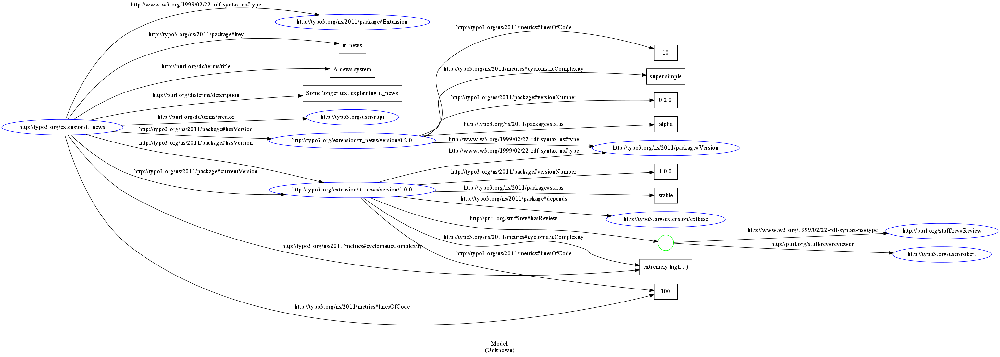

!SLIDE new-chapter center

# Ideas
## Lots…

!SLIDE new-chapter center

# Time
## none…

!SLIDE

# Current Tech Stack
## [http://ter.io/](http://ter.io/)

* [Rails](http://rubyonrails.org/)
* [Redis](http://redis.io/)
* [ElasticSearch](http://www.elasticsearch.org/)

!SLIDE

# Evaluating

* [Neo4j](http://www.neo4j.org/)
* [Clojure](http://clojure-doc.org/)
* [Neovigator](http://neovigator.herokuapp.com/)

!SLIDE

# Similar ideas

* [Oloh](http://www.ohloh.net)
* [code.org](http://code.org/)
* [Firefox Add-ons](https://addons.mozilla.org/)
* [vizgrimoire](http://vizgrimoire.bitergia.org/)

!SLIDE full-screen

!SLIDE full-screen

!SLIDE

# Resources

* [RDF schema](https://raw.github.com/ctrabold/ter-rdf-schema/master/test.png)
* [Neo4j Clojure lib](http://clojureneo4j.info/articles/getting_started.html)
* [Graph Examples](http://cloud.dzone.com/articles/collection-brilliant-neo4j)
